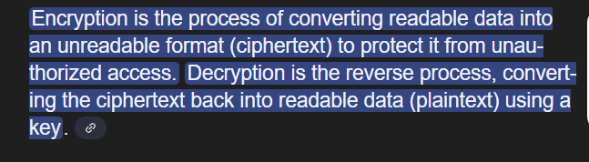
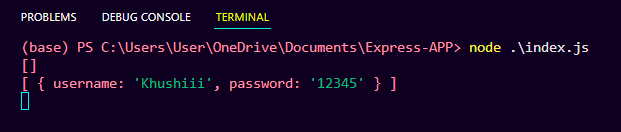

# Express-APP

Lets initialise an express app that we will use to generate an `authenticated backend` today.

- Initialise an empty Node.js project
    
    ```jsx
    npm init -y
    ```
    
- Create an `index.js` file, open the project in visual studio code
    
    ```jsx
    touch index.js
    ```
    
- Add `express` as a dependency
    
    ```jsx
    npm i express
    ```
    
- Create two new  POST routes, one for `signing up` and one for `signing in`
    
    ```jsx
    const express = require('express');
    const app = express();
    
    app.post("/signup", (req, res) => {
    
    });
    
    app.post("/signin", (req, res) => {
    
    });
    
    app.listen(3000);
    ```
    
- Use `express.json` as a middleware to parse the post request body
    
    ```jsx
    app.use(express.json());
    ```
    
- Create an `in memory` variable called `users` where you store the `username` , `password` and a `token` (we will come to where this token is created later.
    
    ```jsx
    const users = []
    ```
    
- Complete the signup endpoint to store user information in the `in memory variable`
    
    ```jsx
    app.post("/signup", (req, res) => {
        const username = req.body.username;
        const password = req.body.password;
    
        users.push({
            username,
            password
        })
        res.send({
            message: "You have signed up"
        })
    });
    ```
    
- Create a function called `generateToken` that generates a random string for you
    
    ```jsx
    function generateToken() {
        let options = ['a', 'b', 'c', 'd', 'e', 'f', 'g', 'h', 'i', 'j', 'k', 'l', 'm', 'n', 'o', 'p', 'q', 'r', 's', 't', 'u', 'v', 'w', 'x', 'y', 'z', 'A', 'B', 'C', 'D', 'E', 'F', 'G', 'H', 'I', 'J', 'K', 'L', 'M', 'N', 'O', 'P', 'Q', 'R', 'S', 'T', 'U', 'V', 'W', 'X', 'Y', 'Z', '0', '1', '2', '3', '4', '5', '6', '7', '8', '9'];
    
        let token = "";
        for (let i = 0; i < 32; i++) {
            // use a simple function here
            token += options[Math.floor(Math.random() * options.length)];
        }
        return token;
    }
    ```
    
- Finish the signin endpoint. It should generate a token for the user and put it in the `in memory` variable for that user
    
    ```jsx
    
    app.post("/signin", (req, res) => {
        const username = req.body.username;
        const password = req.body.password;
    
        const user = users.find(user => user.username === username && user.password === password);
    
        if (user) {
            const token = generateToken();
            user.token = token;
            res.send({
                token
            })
            console.log(users);
        } else {
            res.status(403).send({
                message: "Invalid username or password"
            })
        }
    });
    ```
    

<aside>
💡

This can be improved further by

</aside>


-------------------------- After that -------------------------

<h2> Creating an authenticated EP </h2>

Let’s create an endpoint (/me ) that returns the user their information `only if they send their token

```jsx

app.get("/me", (req, res) => {
    const token = req.headers.authorization;
    const user = users.find(user => user.token === token);
    if (user) {
        res.send({
            username: user.username
        })
    } else {
        res.status(401).send({
            message: "Unauthorized"
        })
    }
})

```
Image : - 
<!-- postman output while running shows token invalid  -->


Now i ahve created a real end point 
now \me returns me my data 🥹🔥(my own username and password)

unless i have someone else token i can't take their details

------- The problem is yet it doesn't use JWTs ( json web tokens)---------🌻
# Tokens vs JWTs

There is a problem with using `stateful` tokens.

## Stateful

By stateful here, we mean that we need to store these tokens in a variable right now (and eventually in a database). 

## Problem

The problem is that we need to `send a request to the database` every time the user wants to hit an `authenticated endpoint`


## Solution

JWTs

--------------
JWTs, or JSON Web Tokens, are a compact and self-contained way to represent information between two parties. They are commonly used for authentication and information exchange in web applications.

**JWTs are Stateless**: JWTs contain all the information needed to authenticate a request, so the server doesn’t need to store session data. All the `data` is stored in the token itself.


Here in the above image i tried understanding the JWT's uses... how it works with a hand drawn image by me....


Now let's go with 
** Replace token logic with jwt **

another Image : - 

what is encrypt and decrypt???


Add the jsonwebtoken library as a dependency - https://www.npmjs.com/package/jsonwebtoken
``` npm install jsonwebtoken ```


STEP 2 : - Get rid of our generateToken function

```jsx  function generateToken() {
    let options = ['a', 'b', 'c', 'd', 'e', 'f', 'g', 'h', 'i', 'j', 'k', 'l', 'm', 'n', 'o', 'p', 'q', 'r', 's', 't', 'u', 'v', 'w', 'x', 'y', 'z', 'A', 'B', 'C', 'D', 'E', 'F', 'G', 'H', 'I', 'J', 'K', 'L', 'M', 'N', 'O', 'P', 'Q', 'R', 'S', 'T', 'U', 'V', 'W', 'X', 'Y', 'Z', '0', '1', '2', '3', '4', '5', '6', '7', '8', '9'];

    let token = "";
    for (let i = 0; i < 32; i++) {
        // use a simple function here
        token += options[Math.floor(Math.random() * options.length)];
    }
    return token;
}
 ```

STep 3 : - Create a `JWT_SECRET` variable

```jsx 
const JWT_SECRET = "USER_APP"; 
```


STEP 4 : - 
Create a jwt for the user instead of generating a token
```jsx 
app.post("/signin", (req, res) => {
    const username = req.body.username;
    const password = req.body.password;

    const user = users.find(user => user.username === username && user.password === password);

    if (user) {
        const token = jwt.sign({
            username: user.username
        }, JWT_SECRET);

        user.token = token;
        res.send({
            token
        })
        console.log(users);
    } else {
        res.status(403).send({
            message: "Invalid username or password"
        })
    }
});
```
In the /me endpoint, use jwt.verify to verify the token


 after changes now let's run it 
 - sign up 
 - signin 

 thsi time it is sharing token with 3parts or dots...and very long this is how jWT works...
 -- \me and this   done without hitting the DB 


